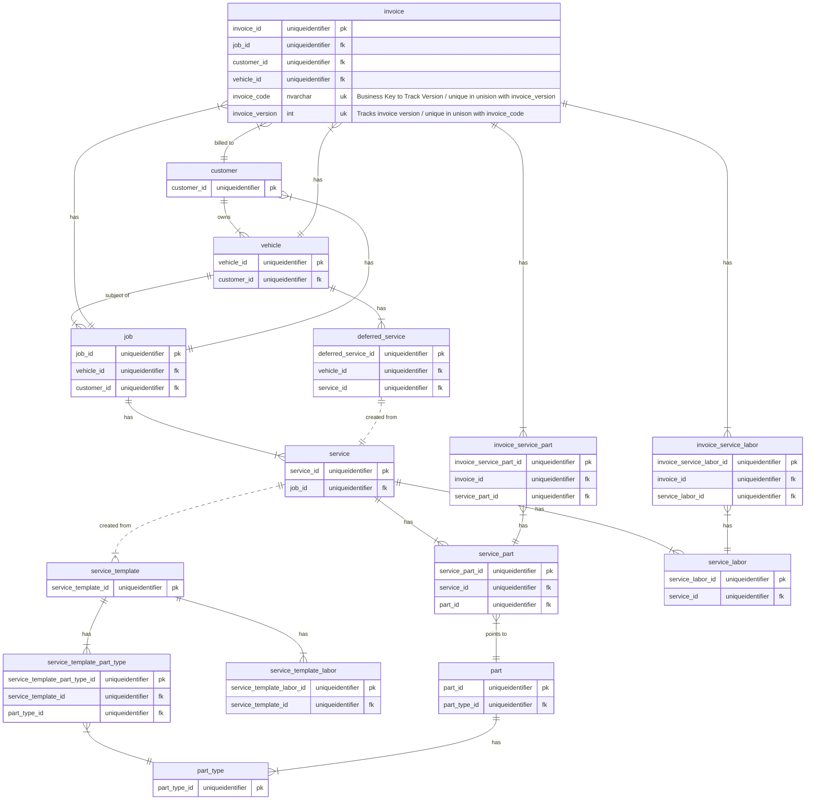
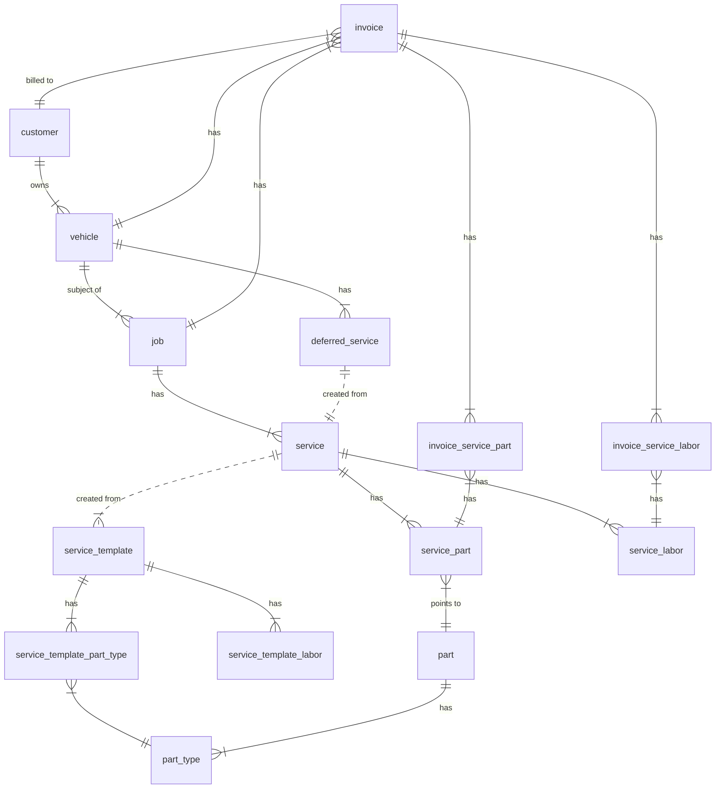

# Physical Diagram

```mermaid
erDiagram
    customer{
        customer_id uniqueidentifier pk
        }

    vehicle{
        vehicle_id uniqueidentifier pk
        customer_id uniqueidentifier fk
        }

    job{
        job_id uniqueidentifier pk
        vehicle_id uniqueidentifier fk
        customer_id uniqueidentifier fk
        }

    service_template{
        service_template_id uniqueidentifier pk
    }
    service_template_part_type{
        service_template_part_type_id uniqueidentifier pk
        service_template_id uniqueidentifier fk
        part_type_id uniqueidentifier fk
    }
    service_template_labor{
        service_template_labor_id uniqueidentifier pk
        service_template_id uniqueidentifier fk
    }
    service{
        service_id uniqueidentifier pk
        job_id uniqueidentifier fk
    }
    service_part{
        service_part_id uniqueidentifier pk
        service_id uniqueidentifier fk
        part_id uniqueidentifier fk
    }
    service_labor{
        service_labor_id uniqueidentifier pk
        service_id uniqueidentifier fk
    }
    deferred_service{
        deferred_service_id uniqueidentifier pk
        vehicle_id uniqueidentifier fk
        service_id uniqueidentifier fk
    }
    invoice{
        invoice_id uniqueidentifier pk
        job_id uniqueidentifier fk
        customer_id uniqueidentifier fk
        vehicle_id uniqueidentifier fk
        invoice_code nvarchar uk "Business Key to Track Version / unique in unision with invoice_version"
        invoice_version int uk "Tracks invoice version / unique in unison with invoice_code"

    }
    invoice_service_part{
        invoice_service_part_id uniqueidentifier pk
        invoice_id uniqueidentifier fk
        service_part_id uniqueidentifier fk

    }
    invoice_service_labor{
        invoice_service_labor_id uniqueidentifier pk
        invoice_id uniqueidentifier fk
        service_labor_id uniqueidentifier fk
    }
    part{
        part_id uniqueidentifier pk
        part_type_id uniqueidentifier fk
    }
    part_type{
        part_type_id uniqueidentifier pk
    }

    customer ||--|{ vehicle : owns
    vehicle ||--|{ job : "subject of"
    job ||--|{ service : "has"
    job ||--|{ customer : "has"
    service ||..|{ service_template : "created from"
    service_template ||--|{ service_template_part_type : "has"
    service_template ||--|{ service_template_labor : "has"
    service_template_part_type }|--|| part_type : ""
    service ||--|{ service_part : "has"
    service ||--|{ service_labor : "has"
    service_part }|--|| part : "points to"
    part ||--|{ part_type : "has"
    vehicle ||--|{ deferred_service : "has"
    deferred_service ||..|| service : "created from"
    invoice }|--|| customer : "billed to"
    invoice }|--|| job : "has"
    invoice }|--|| vehicle : "has"
    invoice ||--|{ invoice_service_part : "has"
    invoice ||--|{ invoice_service_labor : "has"
    invoice_service_part }|--|| service_part : "has"
    invoice_service_labor }|--|| service_labor : "has"
```
---
# Logical Diagram

```mermaid
erDiagram
    customer
    vehicle
    job
    service_template
    service_template_part_type
    service_template_labor
    service
    service_part
    service_labor
    deferred_service
    invoice
    invoice_service_part
    invoice_service_labor
    part
    part_type

    customer ||--|{ vehicle : owns
    vehicle ||--|{ job : "subject of"
    job ||--|{ service : "has"
    service ||..|{ service_template : "created from"
    service_template ||--|{ service_template_part_type : "has"
    service_template ||--|{ service_template_labor : "has"
    service_template_part_type }|--|| part_type : ""
    service ||--|{ service_part : "has"
    service ||--|{ service_labor : "has"
    service_part }|--|| part : "points to"
    part ||--|{ part_type : "has"
    vehicle ||--|{ deferred_service : "has"
    deferred_service ||..|| service : "created from"
    invoice }|--|| customer : "billed to"
    invoice }|--|| job : "has"
    invoice }|--|| vehicle : "has"
    invoice ||--|{ invoice_service_part : "has"
    invoice ||--|{ invoice_service_labor : "has"
    invoice_service_part }|--|| service_part : "has"
    invoice_service_labor }|--|| service_labor : "has"
```

---
