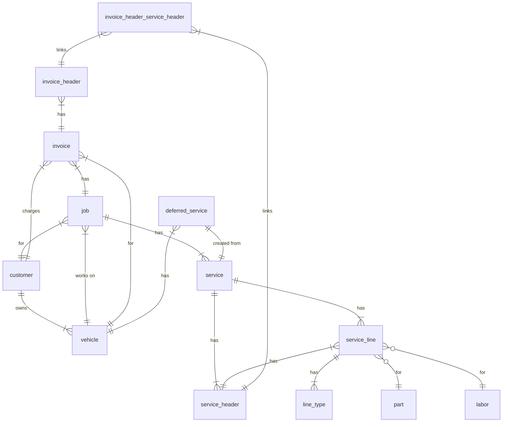
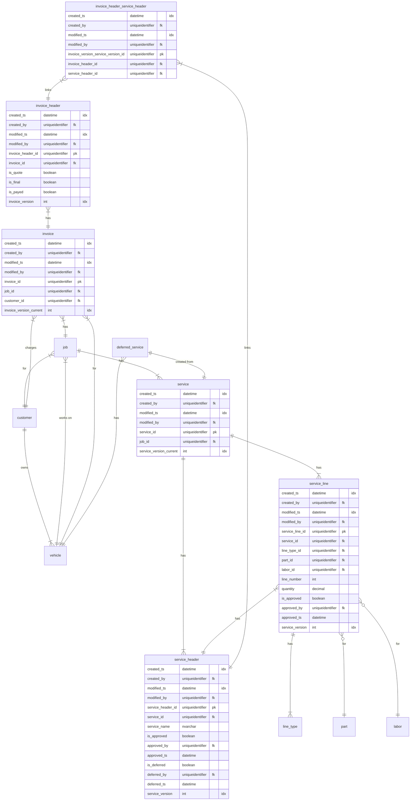

# Link to ERD https://dbdiagram.io/d/6425fe455758ac5f17259645

# logical model

```mermaid
erDiagram
    job }|--|| customer : "for"
    customer ||--|{ vehicle : "owns"
    job }|--|| vehicle : "works on"
    job ||--|{ service : "has"
    service ||--|{ service_line : "has"
    service ||--|{ service_header : "has"
    service_line }|--|| service_header : "has"
    service_line ||--|{ line_type : "has"
    service_line }o--|| part : for
    service_line }o--|| labor : for
    invoice }|--|| job : has
    invoice }|--|| customer : charges
    invoice }|--|| vehicle : for
    invoice_header }|--|| invoice: has
    invoice_header_service_header }|--|| invoice_header : links
    invoice_header_service_header }|--|| service_header : links
    deferred_service ||--|| service : "created from"
    deferred_service }|--|| vehicle : has
```
---
# physical model

```mermaid
erDiagram
    job }|--|| customer : "for"
    customer ||--|{ vehicle : "owns"
    job }|--|| vehicle : "works on"
    job ||--|{ service : "has"
    service ||--|{ service_line : "has"
    service ||--|{ service_header : "has"
    service_line }|--|| service_header : "has"
    service_line ||--|{ line_type : "has"
    service_line }o--|| part : for
    service_line }o--|| labor : for
    invoice }|--|| job : has
    invoice }|--|| customer : charges
    invoice }|--|| vehicle : for
    invoice_header }|--|| invoice: has
    invoice_header_service_header }|--|| invoice_header : links
    invoice_header_service_header }|--|| service_header : links
    deferred_service ||--|| service : "created from"
    deferred_service }|--|| vehicle : has

    invoice{
        created_ts datetime "idx"
        created_by uniqueidentifier fk
        modified_ts datetime "idx"
        modified_by uniqueidentifier fk
        invoice_id uniqueidentifier pk
        job_id uniqueidentifier fk
        customer_id uniqueidentifier fk
        invoice_version_current int "idx"
    }

    invoice_header {
        created_ts datetime "idx"
        created_by uniqueidentifier fk
        modified_ts datetime "idx"
        modified_by uniqueidentifier fk
        invoice_header_id uniqueidentifier pk
        invoice_id uniqueidentifier fk
        is_quote boolean
        is_final boolean
        is_payed boolean
        invoice_version int "idx"    
    }

    invoice_header_service_header {
        created_ts datetime "idx"
        created_by uniqueidentifier fk
        modified_ts datetime "idx"
        modified_by uniqueidentifier fk
        invoice_version_service_version_id uniqueidentifier pk
        invoice_header_id uniqueidentifier fk
        service_header_id uniqueidentifier fk
    }

    service{ 
        created_ts datetime "idx"
        created_by uniqueidentifier fk
        modified_ts datetime "idx"
        modified_by uniqueidentifier fk
        service_id uniqueidentifier pk
        job_id uniqueidentifier fk
        service_version_current int "idx"
    }

    service_header {
        created_ts datetime "idx"
        created_by uniqueidentifier fk
        modified_ts datetime "idx"
        modified_by uniqueidentifier fk
        service_header_id uniqueidentifier pk
        service_id uniqueidentifier fk
        service_name nvarchar
        is_approved boolean
        approved_by uniqueidentifier fk
        approved_ts datetime
        is_deferred boolean
        deferred_by uniqueidentifier fk
        deferred_ts datetime
        service_version int "idx"
    }

    service_line {
        created_ts datetime "idx"
        created_by uniqueidentifier fk
        modified_ts datetime "idx"
        modified_by uniqueidentifier fk
        service_line_id uniqueidentifier pk
        service_id uniqueidentifier fk
        line_type_id uniqueidentifier fk
        part_id uniqueidentifier fk
        labor_id uniqueidentifier fk
        line_number int
        quantity decimal
        is_approved boolean
        approved_by uniqueidentifier fk
        approved_ts datetime
        service_version int "idx"
    }
```