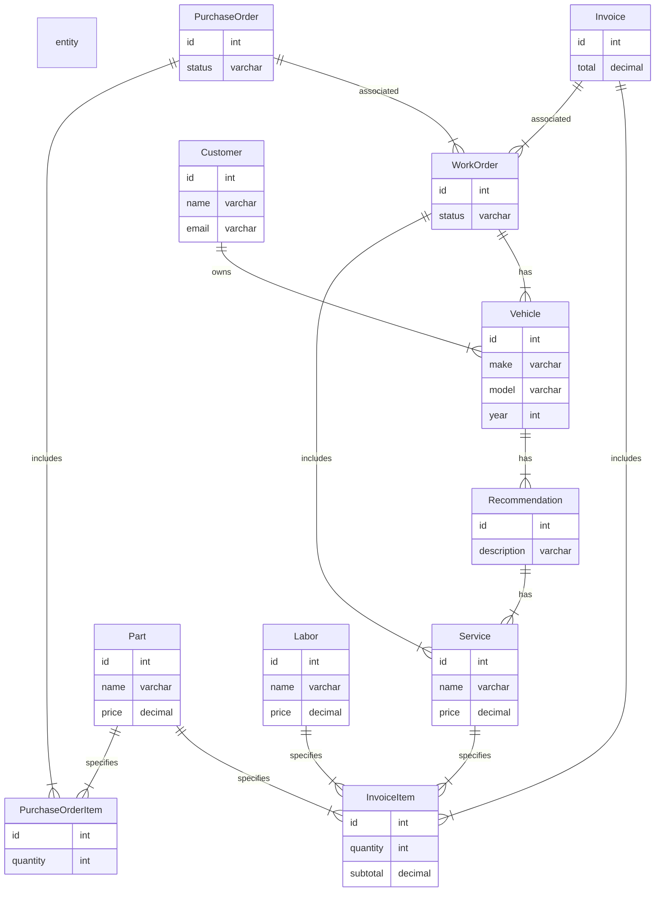

#SC Invoice

A WorkOrder has a status, which can be used to track its progress through the service process. It includes Service items and Recommendation items. A Service can specify one or more Part items and one or more Labor items.

When Part items are ordered, they are associated with a PurchaseOrder, which can have one or more PurchaseOrderItem items. Once the parts arrive, a PurchaseOrder can be associated with a WorkOrder.

When the work is complete, an Invoice is generated based on the Service and Part items used. The Invoice can have one or more InvoiceItem items, each of which specifies a quantity, subtotal, and the Service, Part, or Labor item being billed for.

The Invoice is associated with the WorkOrder it is associated with, allowing us to track what was on the invoice at any point in time.

The Invoice entity is associated with the WorkOrder entity, which allows us to track what was on the invoice at any given point in time.

Whenever an Invoice is generated, it includes InvoiceItem items that specify the Service, Part, or Labor items being billed for, as well as the quantity and subtotal. This information is stored in the database.

If changes are made to the WorkOrder (for example, if a Part item is removed from the service), a new Invoice will need to be generated. This new Invoice will reflect the changes made to the WorkOrder, and will include only the Service, Part, and Labor items that are currently associated with the WorkOrder.

By looking at the Invoice associated with a particular WorkOrder, we can see what items were included on that invoice at the time it was generated. This allows us to track changes made to the WorkOrder over time, and see what items were added or removed from the service at different points in the process.

We Could include a revision number as part of the invoice number to indicate different versions of an invoice for the same work order.

For example, the invoice number could be composed of two parts: the work order number and the revision number. The work order number would be a unique identifier for the work order, and the revision number would be incremented each time a new version of the invoice is generated for the same work order.

So, for a work order with the number "WO123", the initial invoice could be numbered "WO123-01". If a new version of the invoice is needed, it could be numbered "WO123-02", and so on.

